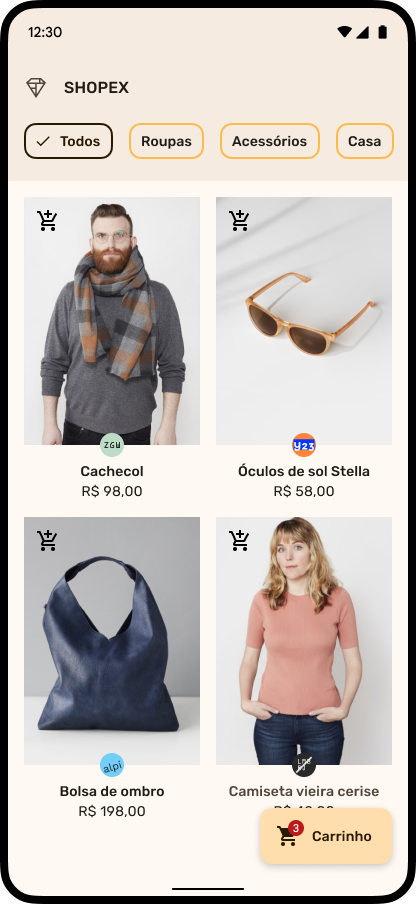

# Shopex

![Flutter version][badge_flutter_version]

O desafio consiste em criar uma loja de produtos com variadas categorias onde o usuário é capaz de adicionar e remover os itens em um carrinho de compras e finalizar o mesmo.

<p align="center">
  
  
</p>

## Começar

Para iniciar faça um `fork` neste repositório e após o termino do desenvolvimento, realize um `Pull Request` para análise.

A menor versão do `Flutter` para ser executado esse projeto é a `3.7.10`.

O projeto se encontra no seu modelo mais básico e apenas com o tema configurado.

## Tarefas

- Listar todos os produtos conforme a categoria selecionada;
- Ao adicionar um produto, ele deve aparecer no carrinho, o `badge` do botão de ação do carrinho deve ser atualizado conforme os produtos vão sendo adicionados e removidos;
- Listar produtos que estão no carrinho;
- Adicionar, remover e limpar produtos do carrinho;
- Ao zerar a quantidade de um produto do carrinho, ele deve sumir;
- Caso aconteça um erro ao buscar os produtos, uma mensagem de erro deve ser exibida;
- Quando o carrinho estiver vazio, uma mensagem deve ser exibida;
- Ao pagar uma compra, um diálogo de sucesso deve ser exibido, todos os produtos são removidos do carrinho e o usuário volta para a tela de produtos;
- Siga o `design` proposto;
- Não haver nenhum problema com a **formatação do código**(`dart format --set-exit-if-changed .`);
- A **análise estática** não deve encontrar nenhum problema no código(`dart analyze --fatal-infos --fatal-warnings lib test`).

## Tarefas adicionais

- Se o usuário não finalizou a compra, então toda vez que ele abrir o app o carrinho deve estar no último estado que o usuário deixou;
- Carregar produtos offline;
- Teste de unidade e de `widgets`;
- Versão `web` responsiva.

# Design

O `mockup` se encontra no `Figma`, acesse [aqui][figma] para visualizar, lá você pode verificar tamanhos, espaçamentos, cores, entre outros recursos.

O tema já está configurado e usa o `Material3`(`src/res/color_schemes.dart`) porém o **estilo de texto**, foi deixado como uma tarefa à ser feita, no arquivo do `figma` você pode encontrar todas as informações.

# Arquitetura 

Recomendo fortemente para esse desafio seguir como base o [Clean Dart][clean_dart].

Você pode usar a `gerência de estado` que preferir.

*Recomendo também usar poucos `packages`.

## Como obter os produtos?

Para obter os produtos da **Shopex**, sua aplicação deverá realizar uma chamada `GET` na URL https://raw.githubusercontent.com/kmartins/flutter_lab/main/desafios/shopex/api/products.json

A resposta é uma lista com os seguintes atributos:
+ Id [id]
+ Título [title]
+ Marca [brand]
+ Categoria [category]
+ Foto [thumbnail]
+ Preço [price] (Está em centavos) 

``` json
{
    "id": 1,
    "title": "Mochila",
    "brand": "squiggle",
    "category": "Acessórios",
    "thumbnail": "https://raw.githubusercontent.com/kmartins/flutter_lab/main/desafios/shopex/api/res/thumbnail_0.jpg",
    "price": 12000
},
```

## Dúvidas, feedbacks e suporte

Tem algum ponto de melhoria? Ou uma ideia de desafio, fique à vontade para contribuir com um `PR`.

Agora se você tiver alguma dúvida ou precisar de alguma ajuda para realizar esse desafio, faça uma pergunta no **fórum** em `Perguntas e Respostas`, envie um e-mail para `ksampaiosp@gmail.com` ou me procure nas redes sociais e me mande uma `DM`.

## Responsáveis

[Kauê Martins][github_profile]
 
## Licença

Esse projeto foi baseado no [Shrine][shrine] e tem apenas o intuito de ser usado como instrumento de aprendizado.

Copyright © 2023 [Kauê Martins](https://github.com/kmartins).<br />
This project is [MIT](https://opensource.org/licenses/MIT) licensed.

[badge_flutter_version]: https://img.shields.io/badge/flutter-v3.7.10-blue?logo=flutter
[clean_data]: https://github.com/Flutterando/Clean-Dart
[figma]: https://www.figma.com/file/q0k6kr1hhWoJOhhwQWS1ZQ/Shopex?node-id=6%3A3487&t=EeIKhl1atZWL56jj-1
[shrine]: https://m2.material.io/design/material-studies/shrine.html
[github_profile]: https://github.com/kmartins
[license_badge]: https://img.shields.io/badge/license-MIT-blue.svg
[license_link]: https://opensource.org/licenses/MIT